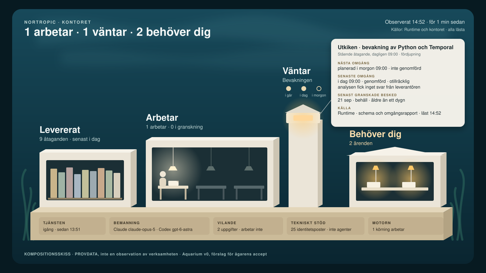

# Aquarium v0 — kontorets lugna fönster

**ACCEPTERAT 2026-09-24 med ägarens preciseringar (AQUARIUM-V0-ACCEPT-20260924).** Byggvägen i avsnitt 5 är ersatt
av ägarens precisering: befintlig Runtime bär de avgränsade koduppgifter som dess kontorsprofil faktiskt kan bära;
planen visar den gällande uppdelningen. Texten nedan är i övrigt det accepterade förslaget.

2026-09-24. **Samlat FÖRSLAG till byggbeslut för ägarens accept, inte ett accepterat bygge.** Beredningen beställdes i
beslutet AP10-SIGNAL-OCH-AQUARIUM-BEREDNING-20260924. Planen i `docs/plan.md` äger aktuellt steg; detta dokument är
det beredda beslutspaketet, ingen parallell masterplan. Ingen Aquarium-kod, installation eller publicering av vyn och
inget nytt repo har påbörjats. Skisserna i denna katalog är kompositionsskisser med **provdata**, inte observationer.

## 1. Den första vyn och vad du kan använda den till

En enda lugn helskärmsvy som du öppnar lokalt på datorn, i webbläsaren eller speglad till tv:n med vanlig
skärmspegling. Den ska på några sekunder svara på tre frågor: **vad kontoret har levererat**, **vad som faktiskt arbetar
eller väntar, och på vad**, och **vad som behöver dig**. Varje uppgift bär sin observationstid och källa. Du fördjupar
genom att välja ett föremål: en lugn panel visar läge, sedan när, källa, revision och begränsningar. Vyn läser. Den
godkänner, byter och startar ingenting, och den ersätter inte planen eller besluten utan visar dem.

Vyn är ett akvarium sett genom glaset: ett diorama i papper och ljust trä på en sockel i mörkt, klart vatten
([skiss](skiss-v0.svg), [lugn dag](skiss-v0-lugnt.svg), [inaktuell observation](skiss-v0-inaktuell.svg)). Fem platser
ligger alltid på samma ställe:

| Plats | Visar | Så syns läget |
|---|---|---|
| Arkivet — *Levererat* | en inbunden volym per levererat eller avslutat åtagande | volymerna står still; fördjupningen visar nytta, gränser, datum och beslutspost |
| Verkstaden — *Arbetar* | en bänk per körning som Runtime observerar som aktiv, med granskning för sig | tänd lampa = observerat aktiv nu; en figur bara där utförare, modell och start är kända |
| Utkiken — *stående åtaganden* | i dag AP-10:s bevakning | fylld punkt = genomförd omgång, ring = planerad; dämpad bärnsten = väntar på känt villkor; senaste granskade besked med eget datum |
| Ägarens bord — *Behöver dig* | verkliga beslut och operatörshandlingar | normalt mörkt; en lampa per ärende, med vad, varför, sedan när och källa |
| Sockeln — *tekniskt stöd* | tjänsten, bemanningen och tekniska poster | utförare och modell per roll; vilande uppgifter och tjänstens identitetsposter som siffror, aldrig som figurer |

Överst står en huvudrad som bär hela bilden på tv-avstånd, till exempel "1 arbetar · 1 väntar · 2 behöver dig" eller
"Kontoret är lugnt · inget arbetar · inget behöver dig", med "Observerat 14:52 · för 1 min sedan" och källorna bredvid.

**Det visuella uttrycket, samma regler överallt:**

- **Vattnets ljus är observationen.** Ljuset i vattnet rör sig långsamt bara medan observationen är färsk. Stannar
  läsningen står vattnet still, färgerna bleknar, lamporna släcks, figurerna blir streckade konturer, varje värde blir
  "senast kända" och en rad säger sedan när. Förvalt läge är inaktuellt: vyn ser levande ut först när den själv har
  kontrollerat observationens ålder. En ny renderingstid föryngrar aldrig gamla uppgifter.
- **Lugn är information.** Inget arbete betyder släckta bänkar i klart, rörligt vatten, inte en död eller trasig bild.
  Stadshuset, ägarens bord, är nästan alltid mörkt, och det är ett gott tecken.
- **Rörelse är dyr.** v0 animerar inga tillståndsövergångar, eftersom det inte finns någon händelseström som kan bära
  dem. Bara vattnets ljus och några växter rör sig, lokalt och i slinga; båda upphör vid inaktuell observation och
  när datorn är inställd på minskad rörelse. Ett vilande ärende animeras aldrig.
- **Arbetet är huvudpersonen.** Föremålen motsvarar verkliga poster i exakt antal: det som slås ihop anger hela sitt
  antal, och inget hittas på för att fylla platsen. Tjugofem identitetsposter är tjugofem tjänstestarter, inte agenter.
- **Färg med få betydelser.** Varmvitt = arbetar, dämpad bärnsten = väntar på känt villkor, bärnstensfärgad lampa och
  text = behöver dig, grått = vilande, streckat = okänt nu. Ingen röd larmfärg i v0: det systemet självt hanterar visas
  lugnt, och det som kräver dig ligger på ditt bord.
- **Språk och läsbarhet.** Svenska, stora rubriker för tv-avstånd, tider i lokal tid med ålder. Inga kör-id:n i
  översikten; de finns i fördjupningen. Mörkt "nattakvarium" som grund.

Du kan använda den för att titta förbi: ligger något på ditt bord, arbetar kontoret, står bevakningen och väntar och i så
fall på vad, och hur gammal är bilden. Du fördjupar när du vill veta varför.

## 2. Vad som ingår nu och vad som uttryckligen väntar

**Ingår i v0:** de fem platserna och huvudraden ur verkliga källor; fördjupningspanelen; källor och ålder per källa;
vyns tre tydligt skilda utseenden (färsk med arbete, färsk och lugn, inaktuell); syntetiska provscenarier som bär
vattenmärket PROVDATA och aldrig blandas med verklig läsning; en lokal ögonblicksbild (etapp 1) och ett lokalt fönster
som läser om regelbundet medan det är öppet (etapp 2).

**Väntar uttryckligen:**

- händelseström med tillståndsbärande rörelse (LIVE med markör) och återspelning av förlopp (REPLAY);
- diagnostiska lager (flöde, befogenhet, risk med flera), zoomnivåer, fler byggnader och stadens tillväxt;
- figurernas egentliga formgivning utöver enkla stiliserade former, ljud och dygnsrytm;
- lägena Executive, Operations och Demo samt en visningspolicy för andra tittare än du;
- åtkomst från tv-webbläsare eller andra enheter i nätet, start vid inloggning och notiser;
- historik som motorn inte längre bär, och trender;
- varje handling: godkänna, starta, byta modell, pausa;
- ett separat Aquarium-repo, Runtime-ändringar och ett projektionskontrakt med driftdetektering utöver v0:s uppräknade
  källor (okända slag av poster visas som "Inte visualiserat än", aldrig improviserat);
- frågan om vilken yta du vill öppna på morgonen, Aquarium eller en framtida arbetsyta, avgörs inte här.

## 3. Återanvända läsvägar och komponenter

Runtime och kontoret behåller sina sanningskällor. Aquarium läser dem och skapar ingen egen uppdragsdatabas,
beslutslogg eller tillståndsmaskin.

| Vad | Befintlig väg | I v0 |
|---|---|---|
| Bevakningens schema och omgångar | `tools/bevakningsbild.py`: `collect()` läser den aktiva releasen, `runtime.obligation status` genom releasens egen kod och omgångarnas rapporter | återanvänds oförändrad, med dess regler för planerad, genomförd, granskad och inaktuell |
| Varför en omgång blev otillräcklig | omgångens analysresultat och Runtimes `model_question.provider_words` (begränsad text ur leverantörens felrader) | återanvänds; Aquarium tolkar inte leverantörstext själv och visar aldrig köpvägar |
| Bemanning och modellfrågor | den aktiva releasens egen `scripts/model_choice.py show`: valet, modellerna i drift, utförare per roll och D030-frågor | återanvänds som läsning |
| Tjänsten | tjänstekvittot med processidentitet, samma kontroll som modellverktyget gör | återanvänds |
| Motorns körningar | lista körande exekveringar och deras väntande aktiviteter, som `work_in_progress` i modellverktyget | en liten läsprob på kontorets sida, körd av Runtimes befintliga tolk; `ServiceIdentity` blir tekniska poster, och Temporals "Running" utan väntande aktivitet blir vilande |
| Leveranser och beslut | `docs/decisions.md` (poster `…-LEVERANS`, `…-AVSLUT`, och `…-BEREDNING` utan `…-ACCEPT`) och `evidence/*/leverans.md`, lästa från kontorets main så som den är känd lokalt | läses med revision; leveranser visar sin källa |
| Ägarens tur | D030-frågor, bevakningens förslag till ägarbeslut, öppna beredningar i beslutsloggen och ett kort block "ÄGARENS TUR" i planens gällande post | blocket är en ny formregel i den befintliga planen, underhållen som planen redan är; motsägelser mot Runtime visas, de slätas inte ut |
| Återgivning | AP08:s `tools/agarbild.py`: fristående svensk HTML, CSP, inga formulär, källplatser som text, daterad projektion, underlag med tid, revision och hash | principerna återanvänds; ny scen och ett enda litet hashbundet skript som bara jämför observationens ålder med klockan; AP08:s sida är skriptfri, så detta är den enda utvidgningen, och utan skriptet visas vyn som inaktuell |
| Inte återanvänt | `tools/kontor.py status` läser Runtime genom primärutcheckningens kod, som inte behöver vara den aktiva releasen | v0 använder aldrig primärutcheckningens Runtime-kod: Runtimes poster läses genom den aktiva releasens hashbundna kod, och motorproben är kontorets egen läskod som körs av Runtimes befintliga tolk |

## 4. Uppdateringsmodell och dess begränsningar

**Etapp 1, ögonblicksbild:** en läsning på begäran skriver en ny daterad privat sida. Att öppna sidan läser ingenting.
Utan skript, eller när observationen är äldre än gränsen, ser den inaktuell ut.

**Etapp 2, fönstret:** en användarägd läsprocess på `127.0.0.1` läser om källorna högst varannan minut medan vyn är
öppen; sidan hämtar senaste läsningen. Inget skjuts ut, inget spelas upp i efterhand.

Två klockor hålls isär och visas båda: **observationstiden** (när Aquarium läste) och **händelsetiden** (när det hände,
till exempel när en omgång rapporterades). Åldersgränsen gäller observationstiden och är satt per källa: tjänst och
motor blir inaktuella efter fem minuter, en bevakningsobservation äldre än ett dygn märks inaktuell (bevakningsbildens
befintliga regel), och plan och beslut visar revision och tid. En källa som inte kan läsas visas som otillgänglig medan
resten visas; ingenting blir tomt och lugnt av att en läsning misslyckats.

**Begränsningar:**

- Aquarium ser bara det Runtime och kontoret registrerar. En interaktiv session, som den som skriver detta, finns inte i
  motorn; den syns som planens gällande post, inte som arbete.
- Mellan två läsningar syns ingenting, och det som hände däremellan återspelas inte. Sover datorn blir det inga
  läsningar, och bilden blir inaktuell.
- Motorn behåller stängda körningar ungefär ett dygn. Äldre historik kommer ur Runtimes egna kvitton, inte ur motorn.
- Kontorets dokument läses från den lokala kunskapen om main; Aquarium hämtar inte själv över nätet och visar vilken
  revision den läste.
- En körning syns som arbete bara om motorn visar väntande aktivitet vid läsningen. Antal följer posterna, inte hur
  mycket arbete de betyder.

## 5. Repohemvist, lokal drift och publiceringsgräns

**Hemvist: kontorsrepot.** `tools/aquarium.py` (läsning och visningssäker projektion), `tools/aquarium_vy.py` (scenen),
`tools/aquarium_fonster.py` (fönstret, etapp 2), prov i `tools/test_aquarium*.py`, anvisning i `tools/AQUARIUM.md` och
leveransbesked i `evidence/aquarium/`. Vyn visar kontorets redovisning; AP08:s ägarbild och bevakningsbilden bor redan
här, och sviten och den skyddade publiceringen finns. Ett separat Aquarium-repo väntar tills vyn ska visa mer än
kontoret eller behöver egen byggkedja eller egen utgivningstakt.

**Byggväg:** kedjedrivaren bygger i en separat worktree av kontorsrepot, fryser acceptans och provdata före koden, låter
granska separat och publicerar genom den befintliga skyddade publiceraren, som kör hela kontorssviten på exakt kandidat.
Ingen presentationskod läggs i Runtime, och ingen profilanpassning i Runtime behövs. Att låta Runtimes utvecklingsväg
bygga v0 föreslås inte: det kostar modellkvot och tid men hjälper inte en vy som måste prövas visuellt i korta varv.

**Lokal drift:** läsningen körs lokalt av dig eller kedjedrivaren. Fönstret lyssnar bara på `127.0.0.1`, startas när du
vill ha det öppet och upphör när processen stängs. Ingen inloggningsstart och ingen tjänst i bakgrunden. Tv:n visar
vyn genom vanlig skärmspegling av webbläsaren.

**Publiceringsgräns:** publikt är kod, provdata, anvisning, skisser och leveransbesked. Privat, i
`evidence/aquarium/local/`, är verkliga ögonblicksbilder och sidor, skärmbilder och mottagar- och ägarprov. Den
visningssäkra projektionen bär titlar, lägen, tider, antal och modellnamn, aldrig promptar, råhändelser,
leverantörsnyttolaster, lokala sökvägar, nycklar eller källinnehåll.

## 6. Etapper, första användbara vy och uppskattning

| Etapp | Innehåll | Klar när | Uppskattning |
|---|---|---|---|
| 0 | Frys acceptansen och provscenarierna (lugnt, arbetar, väntar på kapacitet, ägarbeslut, inaktuellt, källa saknas, vilande och tekniska poster, planerad men inte genomförd omgång) | separat granskad | ½ dag |
| 1 | Läsning, visningssäker projektion och scen som ögonblicksbild ur verkliga källor | **första användbara vy**: du kan öppna den och läsa dagens läge | 2–3 dagar |
| 2 | Fönstret: återkommande läsning, felstängd aktualitet, helskärm och tv-spegling | vyn kan stå öppen och bli inaktuell på rätt sätt | 1–2 dagar |
| 3 | Acceptans, separat granskning av kod och verklig tillämpning, skyddad integration, leveransbesked | slutacceptansen nedan uppfylld | 1 dag, plus 15 minuter av din tid och åtta timmars uthållighetsprov |

Sammanlagt ungefär **4½–6½ arbetsdagar** från din accept; **första användbara vy efter omkring 2½–3½ dagar**.

Osäkerheter: formgivningen kan behöva ett eller två varv till efter din första titt, ungefär en halv dag vardera; fler
än två varv ryms inte i v0, utan då tas formgivningen tillbaka till dig som ett beslut i stället för att arbetet fortsätter;
källornas form (beslutsloggens rubriker, planens block) kan kräva justering; granskare och mottagarprov använder
befintligt abonnemang, och en kvotgräns ger väntan, inte en annan modell; underhållsärendet "ingångarna följer main" och
aktiveringen av AP-10-rättningen går före i tid; motorprobens samspel med SDK:n i den aktiva releasen är inte prövat.

## 7. Acceptans

**Sanningsenlig visning**, prövad mot källorna och inte mot filformat:

1. Spårbarhet: varje visad uppgift har källa och observationstid. En separat granskare jämför den verkliga vyns
   huvuduppgifter med de bevarade källorna.
2. Klassning, med fasta scenarier: leveranser och avslutade åtaganden skiljs från pågående arbete, och ett levererat
   åtagande med stående ansvar (AP10) syns både i Arkivet och i Utkiken; arbete, granskning, väntan och verkligt
   beslutsbehov hålls isär; `ServiceIdentity` och vilande `DevelopmentTask` blir aldrig tända bänkar eller figurer;
   en schemalagd omgång visas som planerad, en genomförd men otillräcklig omgång aldrig som sakbesked, och senaste
   granskade besked behåller sitt eget datum; utförare och modeller skiljs från tekniska stödkörningar.
3. Tid: en gammal ögonblicksbild som öppnas senare ser inaktuell ut; ett stoppat fönster blir inaktuellt inom fem
   minuter; utan skript är vyn inaktuell; renderingstiden visas aldrig som observationstid.
4. Luckor: en saknad eller oläsbar källa visas som otillgänglig, aldrig som tom och lugn.
5. Provdata: syntetiska scenarier bär PROVDATA och kan inte blandas med en verklig läsning.
6. Läsande: inga formulär eller knappar som ändrar något; fönstret svarar bara på läsförfrågningar från `127.0.0.1`;
   läsning och öppning ändrar inga filer utanför Aquariums privata utdata, mätt före och efter.
7. Integritet: publika filer innehåller bara provdata, och den visningssäkra projektionen innehåller inga sökvägar,
   promptar, råhändelser eller nycklar, prövat automatiskt och av granskaren.

**Faktisk användbarhet:**

8. Mottagarprov: en färsk läsare i en separat session ser den verkliga sidan i webbläsaren och svarar utan hjälp på vad
   som är levererat, vad som arbetar nu, vad som väntar och på vad, vad som behöver ägaren och hur gammal bilden är.
   Svaren jämförs med källorna.
9. Ägarprov: du öppnar vyn och svarar på samma frågor, och du bedömer om den är lugn och känns som ett akvarium och
   inte som en tabell. Ditt omdöme avgör; ett nej ger ett formgivningsvarv inom etappen.
10. Uthållighet: vyn står öppen i åtta timmar utan att störa, med låg rörelse och låg last, och blir inaktuell på rätt
    sätt när läsningen stoppas eller datorn sover.
11. Tv-avstånd: huvudraden och platsernas rubriker går att läsa på ungefär tre meters avstånd, prövat i 1920×1080
    helskärm.

Gröna enhetsprov är nödvändiga men inte tillräckliga. Leveransen kräver separat granskning av kod och verklig
tillämpning, skyddad integration och ett leveransbesked som skiljer provdata från verkliga observationer.

## 8. Befogenheter som byggstarten behöver

1. Bygga v0 i kontorsrepot inom sökvägarna i avsnitt 5, samt de poster i plan, beslutslogg och uppdrag som bygget
   kräver, med separat granskning och skyddad publicering genom den befintliga publiceraren (en post per publicering i
   dess fasta tabell, som i dag).
2. Läsa lokalt, utan att skriva, de uppräknade källorna: Runtimes aktiva pekare och konfiguration, tjänstekvittot,
   bevakningens schema och omgångsrapporter, D030-frågor, motorns körande exekveringar (lista och beskrivning) samt
   kontorets beslutslogg, plan och leveransbesked. Runtime läses bara genom den aktiva releasens kod och Runtimes
   befintliga tolk. Aquarium skriver bara i `evidence/aquarium/local/`.
3. Starta och stoppa en användarägd läsprocess som bara lyssnar på `127.0.0.1`, medan vyn används. Ingen
   inloggningsstart, ingen bakgrundstjänst, inget nät utåt.
4. Öppna den lokala vyn i din Chrome genom det befintliga webbläsarverktyget, för visuell kontroll och mottagarprov
   med befintlig modell och befintligt abonnemang. Skärmbilder av verkliga data förblir privata.
5. En kvart av din tid för ägarprovet.

Inget annat ingår: inget nytt repo, ingen Runtime-ändring, ingen ny modell, inga konton eller betalvägar, ingen
administratörsrätt, ingen nätexponering, inga valvskrivningar och ingen ändring av AP-10 eller de vilande posterna.

## 9. Underlaget: ägarbeslut, förslag, nuläge och luckor

**Ägarens egna ord.** "jag tänker mig hur fönstret in kan bli som ett 'akvarium' lite grann och jag kan tex casta det
på en tv" och "som mat, världsklass innebär att det ser visuellt gott ut ... Det blir våran egen ant colony, små
arbetsmyror" (idéns ursprungliga samtal, meddelande 69 och 76). Om Verkstadsgolvet: "nu är det alldeles för mycket,
man blir överväldigat"; därför är v0 fem lugna platser och ingen tät panel. Dagens beslut anger första nyttan, att v0 är
en läsvy och vilka sanningskrav och delar byggbeslutet ska ha.

**Ägaradopterat genom inklistrad text** (Aquarium-samtalets första meddelande): Aquarium är ingen egen sanningskälla,
simulering, spel, befogenhetsyta eller falsk aktivitet; tillståndsbärande rörelse ska vara sann och dekorativ rörelse
skild från den; lugn är information; vanlig webb räcker, ingen egen castinginfrastruktur; tv-läget ska tåla många
timmar; en chef har ingen högre visuell status; integriteten kräver en visningspolicy; riktningen är skandinavisk
formgivning, inte dashboard, barnspel eller metaverse. "Ja, detta gillar jag" gällde den visuella grammatikens
riktning, inte varje punkt.

**Förslag som v0 tar in:** arbetet som huvudperson, figurer bara med evidens, rörelse är dyr, Stadshuset nästan alltid
tråkigt, dioramat, bevarande av arbete och "Inte visualiserat än". **Förslag som väntar:** LIVE-markör och REPLAY,
lager, lägen, zoom, stadens tillväxt, projektionskontraktets driftdetektering och tolkning över semantiska versioner.

**Inte aktuellt som arbetsorder:** kedjan Organization OS → digital tvilling som förkrav och grinden
`AQUARIUM_IMPLEMENTATION_READY` hör till Bootstrap/Kernel-tiden. Dagens beslut bygger v0 direkt på kontorets och
Runtimes befintliga läsvägar. Principen bakom, att projektionen aldrig äger sanningen, behålls.

**Nuläge och historik.** Inget Aquarium finns. Kontoret har två daterade privata läsbilder, AP08:s ägarbild och
bevakningsbilden. Idéunderlaget från 2026-08-31 beskriver ingen befintlig yta. En privat bilaga redovisar dagens
verkliga läge så som v0 skulle visa det, med källa och tid för varje uppgift.

**Saknade källor och luckor.** Bilagan till Aquarium-samtalets första meddelande fångades aldrig. Formgivningsfasen
påbörjades aldrig; inga prototyper, ingen visningspolicy och inga begriplighetsprov har körts. Frågan om ägarens
morgonyta är oavgjord. Modellvalets steg 3 saknar en egen leveranspost i beslutsloggen; v0 visar varje leverans med sin
källa, så en sådan skillnad syns i stället för att döljas.

## 10. Vad beredningen inte gör

Ingen implementation, installation, publicering av vyn eller nytt repo före din accept. AP-10-rättningen är ett
separat arbete i samma plan. De vilande utvecklingsuppgifterna och tjänstens identitetsposter rörs inte och är inget
förkrav. Underhållsärendet "ingångarna följer main" är separat.
